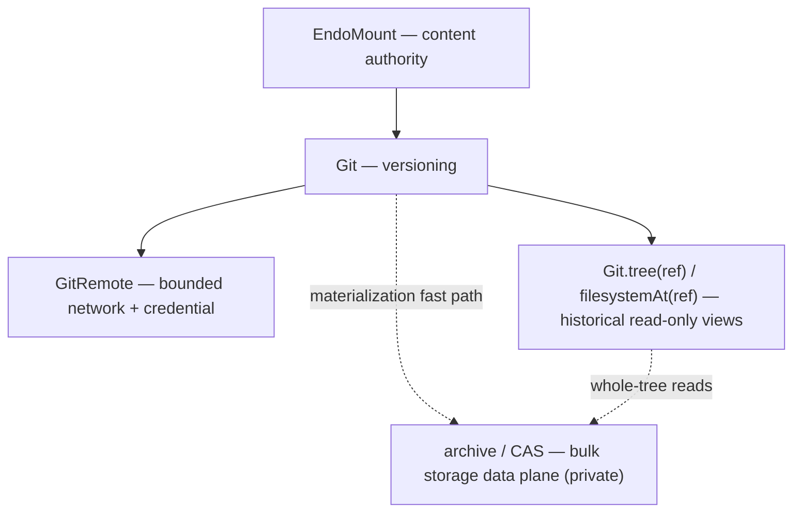
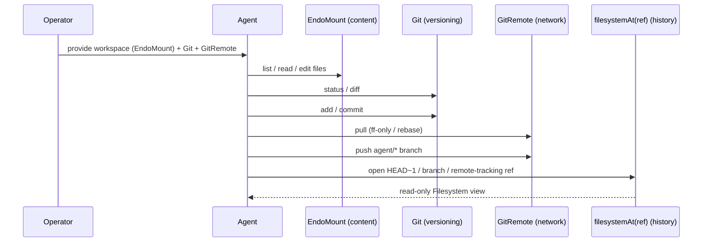

# Roadmap: The Version-Controlled Filesystem Loop

| | |
|---|---|
| **Created** | 2026-05-27 |
| **Updated** | 2026-05-29 |
| **Author** | 0xPatrick (prompted) |
| **Status** | Proposed |

> **Read in order.**
> This is the milestone roadmap that sits on top of the canonical Git trio.
> It requires [daemon-mount-capabilities](daemon-mount-capabilities.md), [daemon-git-capability](daemon-git-capability.md), and [daemon-git-remotes](daemon-git-remotes.md) as prerequisites.

## Summary

The canonical trio defines the capabilities; this document defines the **milestone** they add up to: a *version-controlled filesystem loop* an agent can drive end to end, without ever holding a host path, a shell, ambient network, or a credential it can read.

The north-star loop is one sentence:

> The operator provides a workspace; the agent reads, lists, and edits files through filesystem tools; asks Git for status and diff; commits; pulls and pushes through a bounded `GitRemote`; and inspects history — `HEAD~1`, other branches, the remote-tracking refs — by opening a read-only filesystem view of any ref.

Everything below orders the work that closes the gap between "the trio's capabilities are shipped" and "an agent runs that loop."
It invents no new capabilities of its own: each step links the canonical design where the capability shape is decided, or names the one new sibling design that step needs.

## The Layer Split

The loop's authority decomposes into five layers.
Naming them explicitly is the load-bearing contribution of this roadmap, because every next step lands in exactly one layer and the priority order falls out of which layers gate which.

| Layer | Capability | Authority it carries | Canonical source |
|---|---|---|---|
| **Content** | `EndoMount` / `EndoMountFile` / `EndoMountEntry` | The live worktree: read, list, edit, stat, snapshot one confined physical subtree. The filesystem is the content authority — Git never becomes the way you edit a file. | [daemon-mount-capabilities](daemon-mount-capabilities.md) |
| **Versioning** | `Git` | Status, diff, log, stage, commit, branch, merge, rebase, stash over the content layer's worktree. Derived from an `EndoMount`, never from a path. | [daemon-git-capability](daemon-git-capability.md) |
| **Network + credential** | `GitRemote` | Bounded fetch / pull / push against one host-chosen endpoint, with non-extractable credentials and policy-fixed refspecs. The only layer that crosses the daemon boundary. | [daemon-git-remotes](daemon-git-remotes.md) |
| **Historical read** | git-tree views — `Git.tree(ref)` / `Git.filesystemAt(ref)` | Read-only snapshots of any ref: `HEAD~1`, a branch tip, a remote-tracking ref. The agent "looks at" history as an ordinary filesystem; it cannot mutate through this view. | [daemon-git-capability](daemon-git-capability.md) § Git-Tree Backend (`tree(ref)`); [endo-fs-from-git](endo-fs-from-git.md) (`filesystemAt(ref)`, #374) |
| **Bulk storage (detail)** | archive / CAS / git-as-backend | How many files from one revision move efficiently into a sink (content store, scratch mount). A backend-private data plane, never a guest-visible API. | [daemon-git-capability](daemon-git-capability.md) § Bulk Tree Data Plane |

The split is the discipline that keeps the loop honest:

- **Content is not versioning.**
  An agent edits files through `EndoMount`, not through a git command.
  Git observes and records changes; it is not the editor.
- **Versioning is not network.**
  `Git` never reaches the wire.
  `GitRemote` is a separate, separately-revocable composition that bundles `Git` + transport + credential.
- **Historical read is not worktree mutation.**
  `Git.tree(ref)` / `filesystemAt(ref)` return read-only filesystem views; a holder of a history view cannot commit, stage, or push through it.
- **Bulk storage is an implementation detail, not a layer the agent sees.**
  The archive / CAS path exists so a whole-tree materialization does not degenerate into one subprocess per file.
  The guest still receives object capabilities and structured results, never tar bytes or host paths.

## Reconciling `tree(ref)` and `filesystemAt(ref)`

The canonical design ([daemon-git-capability](daemon-git-capability.md) § Git-Tree Backend, Design Decision 3) names `Git.tree(ref): Promise<ReadableTree>` as the historical-read method.
It returns a bare `ReadableTree` whose blobs are `ReadableBlob`s, usable anywhere a `ReadableTree` is accepted.

`Git.filesystemAt(ref)` is the foundation the historical-read layer of this loop is built on.
It lifts a git tree into a full `@endo/endo-fs` `Filesystem` via `makeGitFsBackend` over the `FsBackend` / `wrapBackend` seam — `readOnly(wrapBackend(makeGitFsBackend(...)))` — rather than returning the narrower `ReadableTree`.
The design and adapter live in [endo-fs-from-git](endo-fs-from-git.md) (the method itself is in PR #374; the doc resolves on `llm` when #374 merges).
A `Filesystem` view is the richer read surface — it is the same shape the content layer exposes for the live worktree, so an agent that knows how to read the worktree already knows how to read history.

`tree(ref)` and `filesystemAt(ref)` are **not** two competing names for one thing; they are two methods in a projection relationship — `tree(ref)` projects the narrower `ReadableTree`, `filesystemAt(ref)` lifts the same git tree into the richer `Filesystem`.
This roadmap builds on `filesystemAt` rather than proposing a parallel surface, and names the reconciliation explicitly so the canonical vocabulary does not fork:

- **`filesystemAt(ref)` is the name** for the historical-read method — adopted from #374 — because its return type (`Filesystem`) matches the content layer and composes with the VFS the canonical design anticipates ([daemon-git-capability](daemon-git-capability.md) § VFS Integration).
  The canonical [daemon-git-capability](daemon-git-capability.md) Design Decision 3 named `tree(ref): ReadableTree`; item 5 reconciles it to `filesystemAt(ref)`.
  Its design home is [endo-fs-from-git](endo-fs-from-git.md).
- **`tree(ref)` is its narrower predecessor**, returning `ReadableTree`.
  Where a consumer only needs the `ReadableTree` read surface (checkin, staging, snapshot inputs), `tree(ref)` remains valid; it can be retained as a thin projection of the `Filesystem` view or deprecated in favor of it.
- The canonical `daemon-git-capability.md` § Git-Tree Backend should be updated to name `filesystemAt(ref)` as the method and `tree(ref)` as the compatibility projection — not to carry two independent historical-read APIs.
  That reconciliation is a canonical-doc edit, tracked as item 5 below; this roadmap names the relationship so the edit is a documentation merge, not a design fork.
- The reconciliation also reconciles `filesystemAt`'s documented trade-offs against the `tree(ref)` vocabulary: per [endo-fs-from-git](endo-fs-from-git.md), the `Filesystem` view's QID is path-based (not the git OID) and its `BlobRef.algorithm` is `'sha256'` (not the git tree's `git-sha1`), reintroducible if `wrapBackend` grows a backend-supplied QID / hash hook.

The layer is the same either way: **historical read-only views of any ref, surfaced as a filesystem the agent already knows how to read.**

## The Loop, Step by Step

Reading the north-star sentence against the layer split yields the agent's actual call sequence.
Each arrow is a capability the trio defines; the roadmap items below close whatever gap still sits under each arrow.

## Roadmap

The items below are ordered by how directly they close the loop, not by implementation convenience.
Each names a one-paragraph what-and-why and links the canonical design where the capability shape is decided.

### 1. Agent tool adapters over `Git` and `GitRemote`

**Layer: versioning + network.**
A thin tool layer that exposes the `Git` and `GitRemote` methods through the agent harness's tool-call interface (Fae / Lal / Genie).
Path-bearing inputs convert at the boundary: a user-entered relative path through the granted worktree mount becomes an `EndoMountEntry` before it reaches `Git`.
The agent sees `status` / `diff` / `add` / `commit` and `fetch` / `pull` / `push` as tool calls; the host has already chosen the mount, the endpoint, the transport, and the credential.
Without this layer the agent either receives a raw `Git` cap (correct authority, wrong tool shape) or each harness re-derives its own ad hoc git-call path.
This is the first thing the loop needs, because every other step is the agent *calling* these tools.
See [daemon-git-capability](daemon-git-capability.md) § Agent-Facing Tool Adapters and [daemon-git-remotes](daemon-git-remotes.md) § Relationship to Existing Git Designs; the adapter work updates [daemon-agent-tools](daemon-agent-tools.md), which predates the handle-first revision.

### 2. A worked end-to-end reference flow (bot-fork roadmap)

**Layer: all five, exercised together.**
One worked example, run end to end: a maintainer's prompt → branch off `llm` via `Git` → edit files via `EndoMount` → `status` / `diff` / `commit` via `Git` → `push` a draft-PR branch via `GitRemote` → inspect the pushed ref via `filesystemAt`.
This is exactly the bot-fork-roadmap pattern this garden already exercises by hand, which makes it the canonical real-world workload for the whole loop.
It is the highest-value validation in the roadmap: a single pass through it touches the content, versioning, network, and historical-read layers at once and surfaces missing seams cheaply, then stands as a regression target.
Depends on item 1 (the adapters are what the example drives).
See [daemon-git-remotes](daemon-git-remotes.md) § Agent MVP Profile for the default remote profile the example runs under.

### 3. Repository bootstrap (`provideGitClone`) and the identity boundary

**Layer: content + network (bootstrap) and versioning (identity).**
Today the loop starts only from a worktree the operator pre-mounted; `GitRemote` is intentionally bound to an existing local `Git`, so cloning has no home on it.
The bootstrap step is a separate host method — `provideGitClone(...)`, named in [daemon-git-remotes](daemon-git-remotes.md) § Repository Bootstrap and `clone` and its Spike Tasks — that composes mount creation + endpoint policy + sealed credential authority + clone-into-the-new-mount, all before a local `Git` exists, and returns the resulting `EndoMount` + `Git`.
Paired with it is the **commit-author / identity boundary**: the agent's commits must be attributed from a policy it does not control (the garden's own per-fork override — `patrick@0xpatrick.dev` for history-rewriting work — is the operational precedent), which wants a capability shape rather than per-dispatch out-of-band knowledge.
These two close the "you give me a URL, the agent runs, and its commits are attributed correctly" gap.
The bootstrap design lives in its own `designs/daemon-git-clone.md`; the identity boundary is a section there or a sibling.
Depends on the `GitRemote` composition being stable.

### 4. Historical-read views land as a `Filesystem` (`filesystemAt(ref)`)

**Layer: historical read.**
- [ ] closes via #374's `filesystemAt` (ticks when #374 merges).

The fourth arrow in the loop — "inspect `HEAD~1` / branches / remote-tracking refs" — is `Git.filesystemAt(ref)` returning a read-only `@endo/endo-fs` `Filesystem` view (the richer surface; see § Reconciling above).
This step closes via [endo-fs-from-git](endo-fs-from-git.md) (#374): the loop builds on top of that `filesystemAt` work rather than proposing its own historical-read view.
The canonical design ships `tree(ref): ReadableTree` first; `filesystemAt` is the `Filesystem`-returning view that lets the agent read history through the same surface it reads the live worktree.
It is what lets the loop close on the read side: an agent that just pushed a branch can open that ref and confirm what it pushed, browse a previous commit before staging a fix, or diff against a branch by reading both as filesystems.
It composes with the bulk-storage data plane (item 6) so a whole-tree history read does not become one object call per file.
See [endo-fs-from-git](endo-fs-from-git.md) for the adapter and [daemon-git-capability](daemon-git-capability.md) § Git-Tree Backend and § VFS Integration for the canonical tree surface it builds on.

### 5. Reconcile `tree(ref)` and `filesystemAt(ref)` into one canonical vocabulary

**Layer: documentation (historical read).**
The fork is now real in the corpus: `tree(ref)` (returning `ReadableTree`) is specified in [daemon-git-capability](daemon-git-capability.md) § Git-Tree Backend and Design Decision 3, and `filesystemAt(ref)` (returning an `@endo/endo-fs` `Filesystem`) is specified and implemented in [endo-fs-from-git](endo-fs-from-git.md) (#374, not yet merged).
A focused edit to [daemon-git-capability](daemon-git-capability.md) § Git-Tree Backend (and Design Decision 3) names `filesystemAt(ref)` as the historical-read method and `tree(ref)` as its `ReadableTree` projection, cross-linking [endo-fs-from-git](endo-fs-from-git.md) as the home of `filesystemAt` — so the canonical doc carries one historical-read API, not two.
The edit must carry `filesystemAt`'s two documented trade-offs into the canonical vocabulary so they are not silently lost: the `Filesystem` view's QID is **path-based, not the git OID**, and its `BlobRef.algorithm` is **`'sha256'`, not the git tree's `git-sha1`** (both reintroducible if `wrapBackend` grows a backend-supplied QID / hash hook — see [endo-fs-from-git](endo-fs-from-git.md) § Status).
This is a documentation merge, not a new design; it is listed as a roadmap item because letting the two names drift apart in the canonical corpus is the failure this roadmap exists to prevent.
Small, but it must happen in the same window the canonical doc next moves.

### 6. Structured result shapes and the bulk-storage data plane

**Layer: versioning (structured shapes) + bulk storage (archive / CAS).**
Two capability-side refinements the loop's quality rests on.
**Structured result shapes** are Phase 7 of [daemon-git-capability](daemon-git-capability.md) (`GitDiff`, `GitFileDiff`, `GitDiffHunk`, `GitShow`, `GitConflict`, `GitMergeResult`, `GitRebaseResult`, structured `stashList`; text methods move to `*Text` siblings): they are what lets a Chat or Familiar surface render a diff as hunks and inline conflict markers instead of re-parsing porcelain, and what lets structured conflict-resolution tooling exist at all.
**The bulk-storage data plane** — `git archive --format=tar` streamed into CAS or a scratch mount, a backend-private fast path ([daemon-git-capability](daemon-git-capability.md) § Bulk Tree Data Plane, shipped as the archive work in #367) — is what keeps whole-tree materializations (item 4's history reads, caplet imports, snapshot staging) from degenerating into per-file object calls.
Both are the polish layer: the loop runs without them, but the rendering and the at-scale reads are where they pay off.
They come last in priority because they refine a loop that already closes on items 1–4; they are not on its critical path.

## Beyond the Loop

The following are real follow-ups that compose with the loop but are not on its critical path.
They are named so a builder dispatch does not mistake them for gaps in the milestone.

- **CLI git verbs** (`endo git status` / `log` / `diff`).
  The substrate for headless harnesses and the operator's debug loop; sibling of [cli-edit-verb](cli-edit-verb.md) / [cli-store-verb-text-modes](cli-store-verb-text-modes.md).
  The loop closes through the tool adapters (item 1) without it; the CLI is a parallel surface, not a prerequisite.
- **Bank-backed credential durability.**
  Once [daemon-capability-bank](daemon-capability-bank.md) lands, the fd-pipe askpass helper sources credentials from the bank instead of the daemon-process-local map, surviving restart for multi-repo / scheduled workflows ([daemon-git-remotes](daemon-git-remotes.md) § Initial Backend).
- **Provider advisory layer.**
  An opt-in layer that *queries* (does not enforce) GitHub / GitLab / Forgejo branch-protection, draft-state, required-checks — useful when the agent needs to know "is this PR un-drafted?" before acting.
  Design Decision 10 of [daemon-git-remotes](daemon-git-remotes.md) keeps the *enforcement* boundary server-side; this only reads the provider API.
- **Linked-worktree and submodule worked example.**
  The pin algorithm ([daemon-git-capability](daemon-git-capability.md) Design Decision 7) handles `git worktree add` and submodules in theory; a worked example pins the contract.
- **Audit-log surfaces, timing observability, editor / patch-apply integration.**
  Operator-facing audit exports, the `captpMs` / `transportMs` timing fields ([daemon-git-remotes](daemon-git-remotes.md) § Spike Tasks), and composing `Git` with the chat / endopi edit tools so a proposed patch applies to the worktree as a real reviewable change.

## Dependencies

| Design | Relationship |
|---|---|
| [daemon-mount-capabilities](daemon-mount-capabilities.md) | Content layer (mount-scoped descriptors, snapshot, host-private backing). |
| [daemon-git-capability](daemon-git-capability.md) | Versioning + historical-read layers (`Git`, `tree(ref)`, `readOnly()`, bulk data plane, Phase 7 structured shapes). |
| [endo-fs-from-git](endo-fs-from-git.md) | Historical-read foundation: `Git.filesystemAt(ref)` returning an `@endo/endo-fs` `Filesystem` over the git object database (#374). Item 4 closes via it; item 5 reconciles its vocabulary with `tree(ref)`. |
| [daemon-git-remotes](daemon-git-remotes.md) | Network + credential layer (`GitRemote`, credential injection, bootstrap follow-up, audit). |
| [daemon-agent-tools](daemon-agent-tools.md) | Updated by item 1 — names which capabilities surface as agent tools. |
| [daemon-capability-bank](daemon-capability-bank.md) | Future home for durable credential authority (Beyond the Loop). |
| [cli-edit-verb](cli-edit-verb.md), [cli-store-verb-text-modes](cli-store-verb-text-modes.md) | CLI-side blob editing / storage; the CLI git verbs compose with them. |
| [endopi-edit-tool](endopi-edit-tool.md) | Endopi raft's edit-tool design; informs the agent-side edit-and-commit loop. |

## Implementation Alignment

This section records how the implementation work maps onto the loop.
It is not normative; it is the bridge between this roadmap and the PRs realizing the trio.

- **Content + versioning shipped:** `EndoMount` is **Complete** ([daemon-mount-capabilities](daemon-mount-capabilities.md)); local `Git` Phases 0–5 plus the bulk-archive fast path shipped via #364/#367.
- **Network shipped:** `GitRemote` + credentials Phases 1–5 and the fd-pipe askpass (design-compliant credential injection) shipped via #365/#368.
- **Historical-read `Filesystem` view — the foundation item 4 builds on (#374):** `Git.filesystemAt(ref)` lifts a git tree into an `@endo/endo-fs` `Filesystem` over the `FsBackend` / `wrapBackend` seam (the seam consolidated by #373; `filesystemAt` and its design doc [endo-fs-from-git](endo-fs-from-git.md) in #374).
  It is the richer historical-read surface this roadmap's item 4 closes via, and the reason item 5 reconciles the canonical `tree(ref)` vocabulary with it rather than letting the two names fork.
  The bot's git stack and the `filesystemAt` work are orthogonal layers of the same `GitBackend` contract — outbound network (#365) vs. inbound tree reads (#374) — sharing only validators that predate both; the only contact point is an additive keep-both textual merge, not a design conflict.
  Item 4 stays a `- [ ]` until #374 merges.

## Design Decisions

1. **The roadmap is a milestone, not a capability catalogue.**
   It orders the work that turns the canonical trio into a loop an agent can drive; it invents no new capabilities.
   New capability designs (the clone bootstrap, the provider advisory layer) are named here but designed in their own documents.
2. **The layer split is the load-bearing contribution.**
   Content / versioning / network / historical-read / bulk-storage each carry a distinct authority; every roadmap item lands in exactly one layer, and the priority order falls out of which layers gate which.
   Keeping the layers distinct is what keeps the agent from editing through git, reaching the wire through `Git`, or mutating through a history view.
3. **Historical read is two methods in a projection relationship.**
   `filesystemAt(ref)` (returns a `Filesystem`) is the historical-read method; `tree(ref)` (returns the narrower `ReadableTree`) is its predecessor / projection.
   The canonical doc carries one API (item 5), reconciled rather than forked.
4. **The bot-fork-roadmap workflow is the integration test.**
   The garden's own PR-creation flow exercises every layer of the loop on real workloads; the worked end-to-end example (item 2) turns that manual workflow into a regression target.
5. **Bulk storage is a detail, not a layer the agent sees.**
   Archive / CAS / git-as-backend is a backend-private data plane; no guest-visible API exposes it.
   It refines a loop that already closes, which is why it comes last in priority.

## Open Questions

- **How small is the agent-tool-adapter surface (item 1)?**
  Large enough for its own design, or an update to [daemon-agent-tools](daemon-agent-tools.md)?
  Resolution: defer to the builder dispatch that picks up item 1.
- **Does the worked reference flow (item 2) need an in-daemon per-fork identity override, or does it stay garden-side?**
  Today the override is per-dispatch.
  If item 2 is the canonical worked example, the per-fork identity policy may want to be a host capability (item 3's identity boundary).
  Resolution: scope inside the item 3 design.
- **Does `tree(ref)` survive as a public projection of `filesystemAt(ref)`, or get deprecated outright (item 5)?**
  Resolution: decide when item 4 lands, based on whether any consumer needs the bare `ReadableTree` return type rather than a `Filesystem`.

## Prompt

> Rewrite `designs/daemon-git-next-steps.md` so this PR *becomes* the roadmap for the "version-controlled filesystem loop" milestone: the north-star agent loop is provide-workspace → read/list/edit via filesystem tools → ask Git for status/diff → commit → pull/push via GitRemote → inspect HEAD~1/branches/remotes via filesystemAt(ref).
> Make the layer split explicit (Filesystem/EndoMount = content authority; Git = versioning; GitRemote = bounded network + credential authority; git-tree views = historical read-only snapshots; archive/CAS/git-as-backend = bulk storage detail).
> Reconcile the `Git.filesystemAt(ref)` bridge name with the canonical `Git.tree(ref)` → ReadableTree method.
> Ground every claim in the canonical trio.
