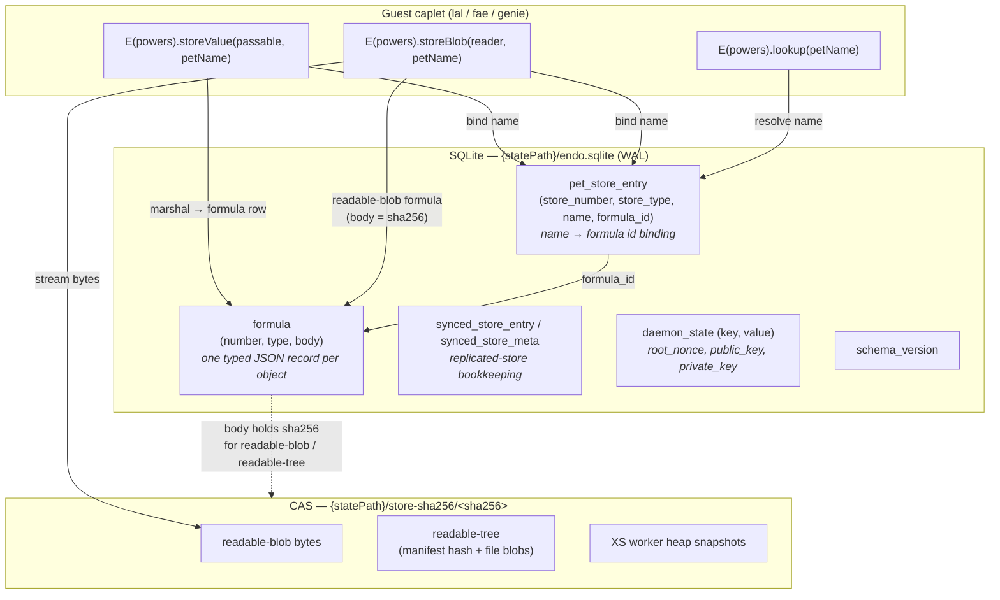
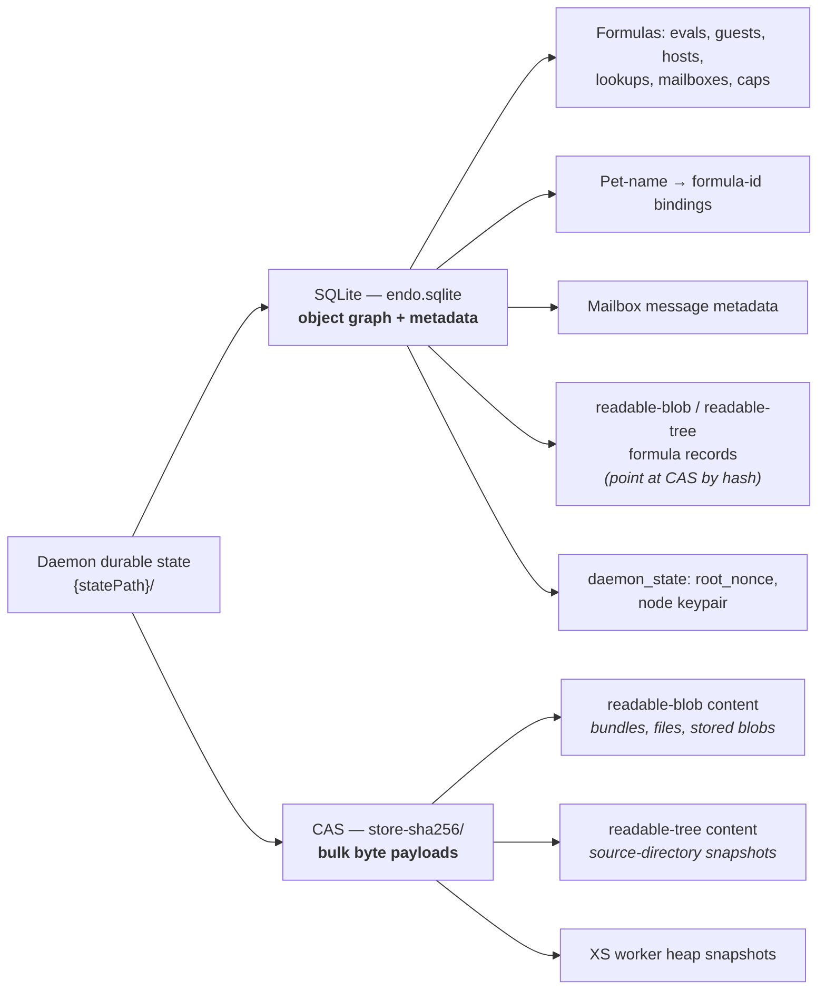
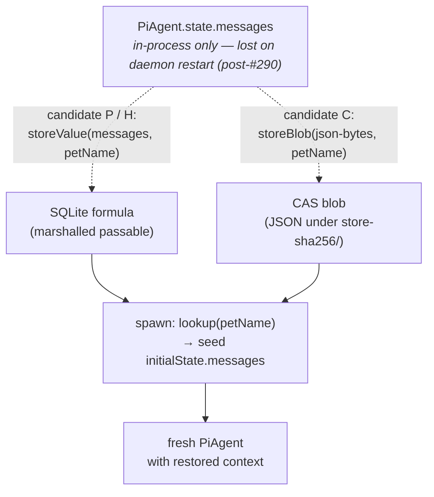

# Daemon Storage Architecture

| | |
|---|---|
| **Created** | 2026-06-02 |
| **Author** | 0xpatrickbot (prompted) |
| **Status** | Reference (describes current behavior) |

A map of where the Endo daemon keeps durable state today, and what lands in
each surface. This is a *reference* for the current implementation, not a
proposal. It exists to ground discussions that touch persistence — e.g. lal
conversation-continuity, the CAS-management roadmap, and any future
git-backed CAS substrate swap.

## Two surfaces

The daemon persists everything under `{statePath}/` in exactly two places:

1. **SQLite** — `{statePath}/endo.sqlite` (WAL mode). The **object graph** and
   all metadata: typed formula records, pet-name bindings, synced-store
   bookkeeping, and daemon-level key/value state.
2. **Content-addressed store (CAS)** — `{statePath}/store-sha256/{sha256}`.
   **Bulk byte payloads** keyed by SHA-256: blob content, source-directory
   trees, and XS worker heap snapshots. This is the one part of daemon state
   that deliberately did *not* migrate to SQLite, because streaming binary
   data is better served by filesystem I/O than SQLite blobs (see
   `packages/daemon/SQLITE-MIGRATION.md`).

The two surfaces **layer**: a SQLite formula of type `readable-blob` or
`readable-tree` holds a SHA-256 in its `body`, and the bytes that hash names
live in the CAS. Objects reference bytes by hash; bytes never reference
objects.

## How storage works currently

**Write paths from a guest's `powers`:**

- `storeValue(passable, petName)` — marshals the passable into a `formula`
  row (type `marshal`), then writes a `pet_store_entry` row binding the pet
  name to that formula id. Value lives entirely in SQLite. The shorter idiom
  for small structured records and capability handles.
- `storeBlob(reader, petName)` — streams the bytes into the CAS via
  `contentStore.store` (returns a SHA-256), creates a `readable-blob` formula
  whose `body` carries that hash, then binds the pet name to it. Bytes in CAS,
  pointer-record in SQLite (`formulateReadableBlob`, `packages/daemon/src/daemon.js`).

**Read path:** `lookup(petName)` resolves the name → formula id via
`pet_store_entry`, loads the `formula` row, and either returns the
unmarshalled passable (for `marshal`) or an `EndoReadable` over the CAS bytes
(for `readable-blob` / `readable-tree`, exposing `.sha256()` / `.text()` /
`.json()` / `.streamBase64()`).

At runtime `pet-store.js` loads all `pet_store_entry` rows into an in-memory
bidirectional multimap on boot and serves reads from memory; writes pass
through to SQLite.

## What goes in what

| Axis | SQLite (formula + pet store) | CAS (`store-sha256/`) |
|---|---|---|
| Addressing | name → formula id → formula JSON | SHA-256 hash → bytes |
| Holds | object graph, capability handles, small structured records | binary blobs, source trees, heap snapshots |
| Mutability | a pet name can be rebound; a formula is immutable | content immutable by construction (new content → new hash) |
| Per-guest namespace | yes (pet stores are per-guest formulas) | flat; the daemon owns the hash space |
| Guest write API | `storeValue(passable, petName)` | `storeBlob(reader, petName)` |
| Guest read API | `lookup(petName)` → passable | `lookup(petName)` → `EndoReadable` |
| Lookup-by-hash from guest | n/a | not exposed (daemon-internal `contentStore.fetch`) |
| Reaped when | no formula transitively retains the pet name | no `readable-blob` / `readable-tree` formula retains the hash |
| Suitable for | references, small records | large / binary / de-dupable content |

## Worked example: lal conversation memory

Where an LLM worker's conversation transcript would live makes the layering
concrete. This is the surface the pi-harness migration (#290) regressed and
the candidates under discussion would restore.

- **Candidate P** — snapshot the whole `state.messages` to one pet name each
  turn; `storeValue` → SQLite formula. Smallest diff; O(N²) marshal churn on
  long conversations.
- **Candidate H** (recommended) — write only each turn's *delta* to
  `pi-turn-<inboxNumber>`; `storeValue` → SQLite formula; concat on spawn.
  O(1) per-turn writes, per-turn pruning possible.
- **Candidate C** — same shape via `storeBlob` → CAS bytes. Semantically
  isomorphic to P today; becomes attractive only once a **git-backed CAS**
  lands, where each per-turn blob commit yields a free `git log` of the
  agent's memory. The migration from an H-shaped `storeValue` writer to a
  CAS-blob `storeBlob` writer is a ~10-LOC substrate swap; the `pi-turn-<N>`
  naming is unchanged.

See the durable scoping note (garden journal,
`projects/endo-but-for-bots/lal-pi-harness-memory-regression.md`) for the full
candidate comparison.

## Related designs

- `designs/daemon-cas-management.md` — moving the CAS into the Rust supervisor
  with retain/release reference counting and mark-sweep GC.
- `designs/daemon-endo-rust-sqlite.md` — the Rust/SQLite persistence direction.
- `designs/daemon-endor-architecture.md` — the broader endor architecture.
- `designs/lal-reply-chain-transcripts.md` /
  `designs/lal-transcript-memory-management.md` — the pre-pi-harness durable
  transcript model the memory candidates re-express.
- `packages/daemon/SQLITE-MIGRATION.md` — the filesystem → SQLite migration,
  including why the CAS stayed on the filesystem.
